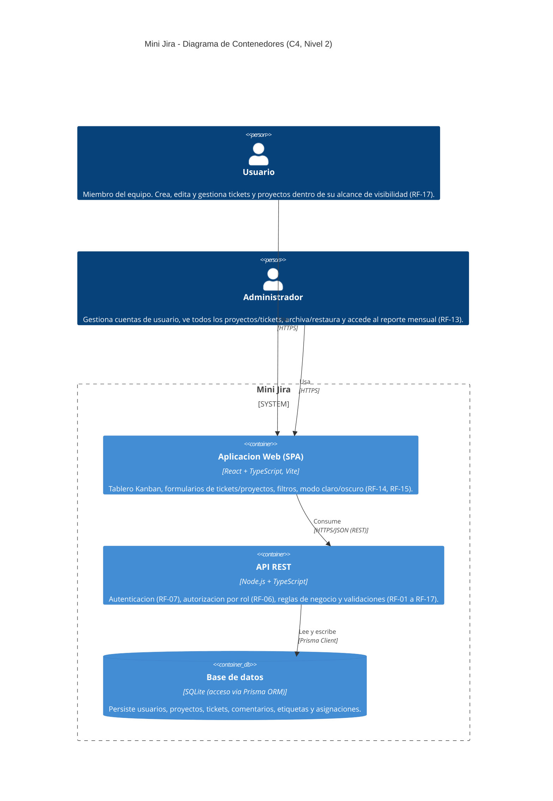
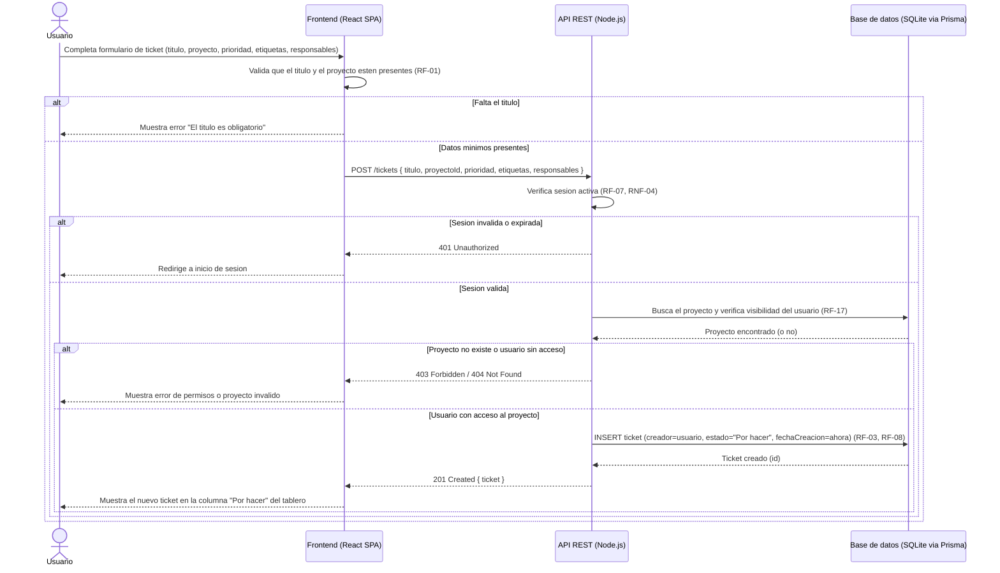

# architecture.md — Mini Jira

> **Fuente:** `docs/specs.md` (v1.1, APROBADO) y `docs/backlog.md`. Este documento no introduce contenedores, servicios ni decisiones de stack que no estén ya definidos en esos documentos (§3 y §7 de `specs.md`, P13). Si diverge de `specs.md`, prevalece `specs.md` (ver `CLAUDE.md`).

## 1. Diagrama de Contenedores (C4 — Nivel 2, HLD)

Contenedores derivados directamente del stack confirmado en `specs.md` §3 (Decisión PO/PM, P13): **React + TypeScript (Vite)** como SPA, **Node.js + TypeScript** como API REST, y **SQLite accedida vía Prisma** como base de datos. No se agregan servicios externos: `specs.md` excluye explícitamente email (Fase 2), integraciones con terceros y tiempo real (fuera de alcance), por lo que no hay contenedores de mensajería, colas ni websockets. Al ser una única instancia de backend contra SQLite (supuesto de `specs.md` §4), no se modela balanceo de carga ni múltiples réplicas de API.

## 2. Diagrama de Secuencia (LLD) — Historia 3: Crear un ticket

Se eligió **Historia 3 — Crear y editar tickets** (`docs/backlog.md`, escenario "Crear un ticket") por ser la más representativa del flujo completo entre capas: combina autenticación/sesión (RF-07), autorización y visibilidad por rol (RF-17), validación de datos obligatorios (RF-01, RF-08), la relación ticket→proyecto uno-a-muchos (RF-03) y la escritura en base de datos vía Prisma — a diferencia de historias más acotadas como mover una tarjeta o comentar, que ejercitan un subconjunto menor de capas y reglas.

## 3. Verificación de sintaxis

Ambos diagramas se extrajeron y se compilaron con `@mermaid-js/mermaid-cli` (`mmdc`), no solo se revisaron manualmente:

- **C4Container:** `mmdc -i diagram_0.mmd -o diagram_0.svg` → generó un SVG válido (36 KB) sin errores. Usa únicamente macros soportadas (`Person`, `System_Boundary`, `Container`, `ContainerDb`, `Rel`), comillas balanceadas y el bloque `System_Boundary { ... }` cierra correctamente.
- **sequenceDiagram:** `mmdc -i diagram_1.mmd -o diagram_1.svg` → generó un SVG válido (33 KB) sin errores. Declara `actor`/`participant` antes de usarlos y los 3 bloques `alt/else/end` están correctamente balanceados y anidados.

Ambos comandos terminaron con código de salida 0 y sin mensajes de error del parser de Mermaid; los diagramas son válidos y renderizan correctamente.
