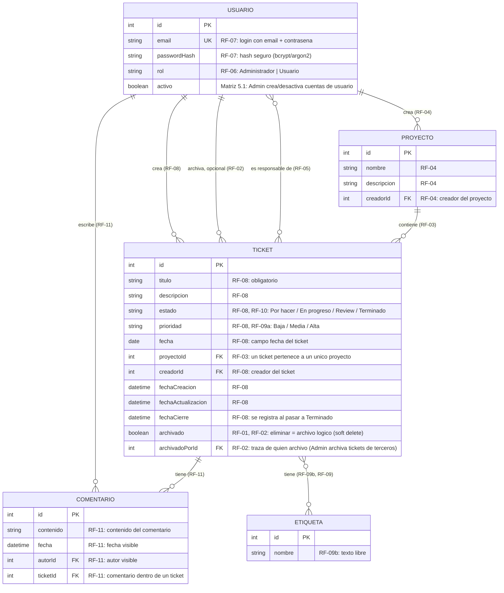

# er_diagram.md — Modelo de Entidades y Relaciones (Mini Jira)

> **Fuente:** `docs/specs.md` (v1.1, APROBADO) y `architecture/architecture.md`. Este documento no introduce entidades, atributos ni relaciones que no se desprendan de un requerimiento funcional (RF) de `specs.md`. No se genera SQL ni tipos de columna definitivos: solo el modelo conceptual. Si diverge de `specs.md`, prevalece `specs.md` (ver `CLAUDE.md`).

## 1. Entidades identificadas y su origen

| Entidad | Justificación (RF) |
|---|---|
| `USUARIO` | RF-06 (roles Administrador/Usuario), RF-07 (login propio) |
| `PROYECTO` | RF-04 (entidad propia: nombre, descripción, creador) |
| `TICKET` | RF-08 (campos del ticket), RF-01/RF-02 (archivo lógico) |
| `ETIQUETA` | RF-09b (etiquetas de texto libre, varias por ticket), RF-09 (filtrado por etiqueta) |
| `COMENTARIO` | RF-11 (comentarios dentro de un ticket, con autor y fecha) |

No se modelan entidades para: notificaciones/email (RF-12, Fase 2), dashboard de métricas (fuera de alcance — RF-13 es una consulta agregada sobre `TICKET`, no una entidad nueva), ni sesión de login (RNF-04 es un requisito de seguridad de implementación, no una entidad de dominio descrita en `specs.md`).

## 2. Diagrama ER

## 3. Trazabilidad de relaciones

| Relación | Cardinalidad | RF de origen |
|---|---|---|
| `USUARIO` crea `PROYECTO` | 1 : N | RF-04 (todo proyecto tiene un creador) |
| `USUARIO` crea `TICKET` | 1 : N | RF-08 (todo ticket tiene un creador) |
| `USUARIO` archiva `TICKET` | 1 : N (opcional) | RF-02 (solo se completa si el Administrador archiva un ticket de un tercero, con traza de quién archivó) |
| `USUARIO` responsable de `TICKET` | N : M | RF-05 (cero, uno o varios responsables por ticket) |
| `USUARIO` escribe `COMENTARIO` | 1 : N | RF-11 (autor del comentario) |
| `PROYECTO` contiene `TICKET` | 1 : N | RF-03 (un ticket pertenece a un único proyecto) |
| `TICKET` tiene `COMENTARIO` | 1 : N | RF-11 (comentarios dentro de un ticket) |
| `TICKET` tiene `ETIQUETA` | N : M | RF-09b (varias etiquetas por ticket), RF-09 (filtrado por etiqueta) |

## 4. Supuestos y pendientes (no resueltos por este documento)

- **Nombre visible de `USUARIO`:** `specs.md` (RF-07) solo especifica `email` y contraseña como campos de autenticación; no menciona un campo de nombre/alias para mostrar en UI (por ejemplo, junto al autor de un comentario). Este documento no lo agrega para no inventar un atributo sin RF que lo respalde; queda como punto a confirmar con el PO/PM antes del modelo físico.
- **Campo `fecha` de `TICKET` (RF-08):** `specs.md` lista `fecha` como campo distinto de `fechaCreacion`, `fechaActualizacion` y `fechaCierre`, sin aclarar su significado (¿fecha límite/vencimiento?). Se mantiene el nombre literal de `specs.md` hasta que se aclare.
- **`ETIQUETA` como catálogo vs. texto libre por ticket:** RF-09b dice que las etiquetas son "texto libre" y las crea cualquier usuario al editar el ticket, sin confirmar si se reutilizan entre tickets (catálogo compartido) o son estrictamente locales a cada ticket. Se modela como entidad con relación N:M por ser filtrable (RF-09) y evitar duplicar el modelo si luego se confirma que es un catálogo compartido; si se confirma que es estrictamente texto libre no reutilizable, esta relación podría simplificarse en el modelo físico.
- **Regla de asignación a terceros (R-06 en `specs.md`):** no afecta el modelo de datos (la relación `USUARIO` – `TICKET` como responsable es la misma independientemente de quién puede crearla), por lo que no genera cambios en este diagrama.
- **Orden de columnas del tablero (R-07 en `specs.md`):** afecta el valor/orden del atributo `estado` de `TICKET`, no la estructura del modelo; no se fija aquí.

No se generan sentencias SQL ni definición de tipos de columna en este documento, según lo solicitado.
